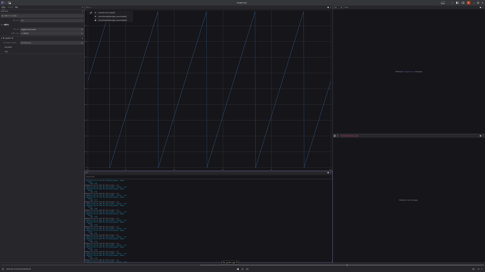

# BlackBox
BlackBoxはROS2用のロギングライブラリです。このライブラリを使用すると、プロセス内でrosbagファイル（Mcap形式）を作成できるため、rosbagファイル作成用の専用ノードを起動する必要がなく、Pub/Sub操作も不要になります。 このライブラリを活用することで、実行時のコンソールログ、独自メッセージ、Pub/Subメッセージを1つのrosbagファイルにまとめて保存することが可能です。作成されたrosbagファイルは[rosbag2](https://github.com/ros2/rosbag2)や[Foxglove](https://foxglove.dev/)でそのまま解析やシミュレーションを行うことができます。

# Foxgloveについて
Foxgloveは、Foxglove Studio（GUIツール）とFoxglove Bridge（ROS2の通信をWebSocketに変換するツール）から構成されています。Foxglove Studioはmcapファイルを直接解析でき、Windows、Mac、スマホ（ブラウザ）で動作します。ROS2が起動しているLinux上でFoxglove Bridgeを起動し、Foxglove StudioでそのIPとポート番号を指定することで接続できます。

[Foxglove Studioのインストール](https://foxglove.dev/download)  
[Foxglove Bridgeのインストール](https://docs.foxglove.dev/docs/connecting-to-data/ros-foxglove-bridge/)

Foxglove Studioは日本語に対応しており、設定から言語変更が可能です。また、フレームレートの調整も設定画面から行えます。

# インストール
```bash
sudo apt install -y ansible
```

ros2ワークスペースのsrc内
```bash
git clone https://github.com/Ayrton2718/blackbox.git
cd blackbox
ansible-playbook --ask-become-pass ansible/dev.yml
```

# このライブラリの使用方法
このライブラリを使用するには、BlackBoxNodeを継承する必要があります。`rclcpp::Node`の継承は避けてください。

```c++
class TestNode : public blackbox::BlackBoxNode {
public:
    TestNode(const std::string &name_space = "") 
        : blackbox::BlackBoxNode(blackbox::debug_mode_t::DEBUG, "test_node", name_space) {}
};
```

`blackbox::debug_mode_t::DEBUG`で、このノードのデバッグモードを指定できます（詳しくは[Logger](#logger)）。

## Logger
実行中のデバッグメッセージをレコードすることができます。ログごとにログの重要度とタグ名を設定することができます。`Foxglove Studio`のLogパネルを用いることで、ログの出力を確認することができます。ログは、`/tagger/namespace/node_name`に格納されています。

[Foxglove Log Panel](https://docs.foxglove.dev/docs/visualization/panels/log) 

```c++
blackbox::Logger _log_info;
_log_info.init(this, blackbox::INFO, "log1");   // ログのレベル、ログのタグ
TAGGER(_log_info, "status : OK");
```

`BlackBoxNode`でDebugモードを指定することで、そのノードのすべてのLoggerのログがコンソール上に出力されるようになります。

```c++
// Debugモード
blackbox::BlackBoxNode(blackbox::debug_mode_t::DEBUG, "test_node", name_space)
// Releaseモード
blackbox::BlackBoxNode(blackbox::debug_mode_t::RELEASE, "test_node", name_space)
```

```c++
/// @brief ログの重要度を指定する
enum log_type_t{
    ERR = rcl_interfaces::msg::Log::ERROR,      // 常にレコード、DebugモードではSTDOUT
    WARN = rcl_interfaces::msg::Log::WARN,      // 常にレコード、DebugモードではSTDOUT
    INFO = rcl_interfaces::msg::Log::INFO,      // 常にレコード、DebugモードではSTDOUT
    DEBUG = rcl_interfaces::msg::Log::DEBUG,    // Debugモードのときだけレコード + STDOUT
};
```

## Record
パッケージ内の内部変数等をレコードするライブラリです。数値型を持つメッセージであれば、`Foxglove Studio`のPlotパネルと連携させることで、グラフを表示することができ、実行中は`Foxglove Bridge`経由で波形を監視し、実行後は生成されるmcapファイルから解析することができます。レコードしたデータは、`/record/namespace/node_name`に格納されています。

[Foxglove Plot Panel](https://docs.foxglove.dev/docs/visualization/panels/plot)  
Foxglove Plotを使う際は、Rangeを設定すると見やすくなります。

```c++
blackbox::Record<std_msgs::msg::Float32MultiArray, true, true> _rec1; // メッセージの型, Publishするか、レコードするか
_rec1.init(this, "rec1", 0);  // トピック名, ドロップ数（何回に一回レコードしないか）
std_msgs::msg::Float32MultiArray msg;
msg.data.push_back((float)(param % 100) / 100);
_rec1.record(msg);
```

## PubRecord
Publishするデータをレコードすることができます。`PubRecord`は通常のPublisherをレコードすることが目的で、`Record`はノードの内部変数を監視することが目的で作られています（Recordと機能的に違う部分としては、トピック名をユーザが設定できる点のみです）。

```c++
blackbox::Topic<std_msgs::msg::String, true> _pub1;    // メッセージの型, レコードするか
_pub1.init(this, "pub1", 10, 0); // トピック名、QoS、ドロップ数（何回に一回レコードしないか）

std_msgs::msg::String str;
str.data = "example";
_pub1.publish(str);
```

## SubRecord
Subscriptionするデータをレコードすることができます。

```c++
blackbox::SubRecord<std_msgs::msg::String, true> _sub1; // メッセージの型, レコードするか
_sub1.init(this, "pub1", 10, [this](std_msgs::msg::String::SharedPtr msg){
    TAGGER(_log1_debug, msg->data);
}, 0); // トピック名、QoS、コールバック、ドロップ数（何回に一回レコードしないか）
```

## Example
[example.cpp](docs/example.cpp)     
[record_node.cpp](docs/record_node.cpp)

# ログファイルの保存場所
直近のログファイルは`/tmp/blackbox_log`に保存されます。  
過去のログは`/var/tmp/blackbox_archive`に保存されます。  
`/tmp/blackbox_log`内には、ノードごとに分かれてMcapファイルが保存されます。

## blackbox_create
ログファイルの保存場所`/tmp/blackbox_log`を作成します。  
プログラムの実行前に必ずこのコマンドを実行する必要があります。

launchファイルにこのような行を追加すれば、自動的にログファイルの保存場所を作成することができます。

```python
import subprocess
subprocess.run(["blackbox_create"])
```

## blackbox_archive
直近のログファイル`/tmp/blackbox_log`を`/var/tmp/blackbox_archive`に移動させます。  
`BLACKBOX`という名前の外部ディスクがあると、そちらに保存されるようになります。

こちらもlaunchファイルに追加することで、自動的にログファイルがアーカイブされるようになります。  
注意点としては、ログファイルの大きさによっては、launchの起動が遅くなる可能性があります。  
対策として、ros2をsystemdで起動するようにし、サービス終了時にアーカイブするようにすることを推奨します。

```python
import subprocess
subprocess.run(["blackbox_archive"])
subprocess.run(["blackbox_create"])
```

## blackbox_merge
`/tmp/blackbox_log`にある、ノードごとに分かれているMcapを一つにまとめることができます。  
一つになったmcapファイルは、`merged.mcap`として出力されます。

```bash
# 最後に実行したものに対して行う
blackbox_merge '/tmp/blackbox_log' 
# 過去のBlackBoxに対して
blackbox_merge '/var/tmp/blackbox_archive/blackbox_2024-03-24_21-24-14' 
# 現在のディレクトリに対して
blackbox_merge .
```

# Overview

