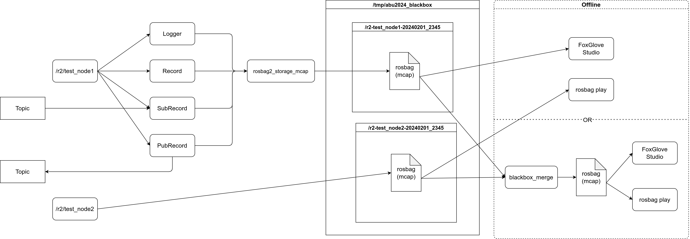

# BlackBox
BlackBoxライブラリは、航空機のフライトレコーダーに着想を得たもので、ロボットのTopic、ログ、エラー、パラメータ、変数などの状態を記録し、後で分析することができます（リアルタイムでもできます）。ログデータはmcap形式で保存され、[FoxGlove](https://foxglove.dev/)や[rosbag2](https://github.com/ros2/rosbag2)と組み合わせることで、強力な分析ツールとして活用できます。

# FoxGloveについて
FoxGloveは、FoxGlove Studio（GUIツール）とFoxGlove bridge（ROS2の通信をWebSocketに変換するツール）から構成されています。FoxGlove Studioはmcapファイルを直接解析でき、Windows、Mac、スマホ（ブラウザ）で動作します。ROS2が起動しているLinux上でFoxGlove Bridgeを起動し、FoxGlove StudioでそのIPとポート番号を指定することで接続できます。

[FoxGlove Studioのインストール](https://foxglove.dev/download)  
[FoxGlove Bridgeのインストール](https://docs.foxglove.dev/docs/connecting-to-data/ros-foxglove-bridge/)

FoxGlove Studioは日本語に対応しており、設定から言語変更が可能です。また、フレームレートの調整も設定画面から行えます。

# インストール
```
sudo apt install -y ansible
ansible-playbook --ask-become-pass ansible/dev.yml
```

# このライブラリの使用方法
このライブラリを使用するには、BlackBoxNodeを継承する必要があります。rclcpp::Nodeの継承は避けてください。
```c++
class TestNode : public blackbox::BlackBoxNode

TestNode(const std::string &name_space = "") 
        : blackbox::BlackBoxNode(blackbox::debug_mode_t::DEBUG, "test_node", name_space){}
```

blackbox::debug_mode_t::DEBUGで、このノードのデバッグモードを指定できる（詳しくは[Logger](##-Logger)）

## Diagnostic
各モジュールの状態を監視するためのもの。rvizやFoxgloveを用いることで、可視化することができる。smbusのセンサやアクチュエータには既にDiagnosticが組み込まれているため、smbusを使用する際は、センサ一つ一つにDiagnosticを適用する必要はありません。センサの初期化やオフセットの成功状態などに適用することができます。

[GitHub](https://github.com/ros/diagnostics/tree/ros2)  
[FoxGlove Diagnostics Panel](https://docs.foxglove.dev/docs/visualization/panels/diagnostics/)  
[ROS1での仕様例](https://qiita.com/srs/items/46c8593dad23497902a8)  

```c++
blackbox::Diagnostic  _diag1;
_diag1.init(this, "diag1");                 // diagnosticのモジュール名を指定する
_diag1.ok("OK");                            // 状態とメッセージを設定
_diag1.warn("sometime lost connection");
_diag1.error("lost connection");
```

## Logger
実行中中のデバッグメッセージをレコードすることができる。ログのごとにログの重要度ととタグ名を設定することができる。`FoxGlove Studio`のLogパネルを用いることで、ログの出力を確認することができます。ログは、`/tagger/namespace/node_name`に格納されています。

[FoxGlove Log Panel](https://docs.foxglove.dev/docs/visualization/panels/log) 

```c++
blackbox::Logger  _log_info;
_log_info.init(this, blackbox::INFO, "log1");   // ログのレベル、ログのタグ
TAGGER(_log1, "status : OK");
```

BlackBoxNodeでDebugモードの指定をすることで、そのノードのすべてのLoggerのログがコンソール上に出力されるようになる。
```c++
blackbox::BlackBoxNode(blackbox::debug_mode_t::DEBUG, "test_node", name_space) // Debugモード
blackbox::BlackBoxNode(blackbox::debug_mode_t::RELEASE, "test_node", name_space) // Releaseモード
```

```c++
/// @brief ログの重要度を指定する
enum log_type_t{
    ERR = rcl_interfaces::msg::Log::ERROR,      // 常にレコード、Debug modeはSTDOUT
    WARN = rcl_interfaces::msg::Log::WARN,      // 常にレコード、Debug modeはSTDOUT
    INFO = rcl_interfaces::msg::Log::INFO,      // 常にレコード、 Debug modeはSTDOUT
    DEBUG = rcl_interfaces::msg::Log::DEBUG,    // Debug modeのときだけレコード + STDOUT
};
```

## Record
パッケージ内の内部変数等をレコードするライブラリです。数値型を持つメッセージであれば、`FoxGlove Studio`のPlotパネルと連携させることで、グラフを表示することができ、実行中は`FoxGlove Bridge`経由で波形を監視し、実行後は生成されるmcapファイルから解析することができます。レコードしたデータは、`/record/namespace/node_name`に格納されています。

[FoxGlove Plot Panel](https://docs.foxglove.dev/docs/visualization/panels/plot)  
FoxGlove Plotを使う際は、Rangeを設定すると見やすくなります。

```c++
blackbox::Record<std_msgs::msg::Float32MultiArray, true, true>   _rec1;　// メッセージの型, Publishするか、レコードするか
_rec1.init(this, "rec1", 0);  // トピック名, ドロップ数（何回に一回レコードしないか）
std_msgs::msg::Float32MultiArray msg;
msg.data.push_back((float)(param % 100) / 100);
_rec1.record(msg);
```

## PubRecord
Publishするデータをレコードすることができます。PubRecordは通常のPublisherをレコードすることが目的で、Recordはノードの内部変数を監視することが目的で作られています。。（Recordと機能的に違う部分としては、topic名をユーザが設定できる点のみです）

```c++
blackbox::Topic<std_msgs::msg::String, true>    _pub1;    // メッセージの型, レコードするか
_pub1.init(this, "pub1", 10, 0); // トピック名、qos、ドロップ数（何回に一回レコードしないか）

std_msgs::msg::String;
str.data = "lol";
_pub1.publish(str);
```

## SubRecord
Subscriptionするデータをレコードすることができます。

```c++
blackbox::SubRecord<std_msgs::msg::String, true>    _sub1; // メッセージの型, レコードするか
_sub1.init(this, "pub1", 10, [this](std_msgs::msg::String::SharedPtr msg){
                TAGGER(_log1_debug, msg->data);
            }, 0); //トピック名、qos、Callback、ドロップ数（何回に一回レコードしないか）
```

## Example
[example.cpp](docs/example.cpp)     
[record_node.cpp](docs/record_node.cpp)

# ログファイルの保存場所
直近のログファイルは`/tmp/blackbox_log`に保存される。
過去のログは`/var/tmp/blackbox_archive`に保存される。
`/tmp/blackbox_log`内には、ノードごとに別れてMcapファイルが保存される。

## blackbox_create
ログファイルの保存場所`/tmp/blackbox_log`を作成する。
プログラムの実行前に必ずこのコマンドを実行する必要がある。

launchファイルにこのような行を追加すれば、自動的にログファイルの保存場所を作成することができる。
```python
import subprocess
subprocess.run(["blackbox_create"])
```

## blackbox_archive
直近のログファイル`/tmp/blackbox_log`を`/var/tmp/blackbox_archive`に移動させる
`BLACKBOX`という名前の外部ディスクがあるとそちらに保存されるようになる。

こちらもlaunchファイルに追加することで、自動的にログファイルがアーカイブされるようになる。
注意点としては、ログファイルの大きさによっては、launchの起動が遅くなる可能性がある。
対策として、launcher_daemonと組み合わせて、終了時にarchiveするようにすることを推奨する。
```python
import subprocess
subprocess.run(["blackbox_archive"])
subprocess.run(["blackbox_create"])
```

## blackbox_merge
`/tmp/blackbox_log`にある、ノードごとに別れているMcapを一つにまとめることができる。
一つになったmcapファイルは、`merged.mcap`として出力される。
```bash
# 最後に実行したものに対して行う
blackbox_merge '/tmp/blackbox_log' 
# 過去のBlackboxに対して
blackbox_merge '/var/tmp/blackbox_archive/blackbox_2024-03-24_21-24-14' 
# 現在のディレクトリに対して
blackbox_merge .
```

# Overview

